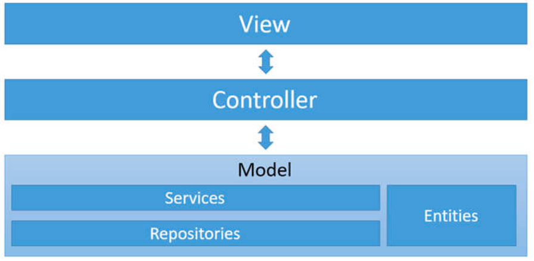

# 18 Section - Project - Web System with ASP.Net Core MVC and Entity Framework

### ASP.Net Core

     • ASP.NET Core is an open-source modular web-application framework. It is a redesign of ASP.NET that unites the previously separate ASP.NET MVC and ASP.NET Web API into a single programming model. Despite being a new framework, built on a new web stack, it does have a high degree of concept compatibility with ASP.NET;
     • https://en.wikipedia.org/wiki/ASP.NET_Core
     • The framework works with a well-defined structure, including:
          • Controllers;
          • Views;
          • Models;
               • View Models;
     • https://docs.microsoft.com/en-us/aspnet/core/mvc/overview

### Web MVC applications with template engine

  

### Responsibility of each MVC part

     • Model: domain entities structure and their transformations (domain model):
          • Entities;
          • Services (related to entities):
               • Repositories (persistent data access);
     • Controllers: receives user interactions and treat them;
     • Views: defines structure and behaviour of user interface;

##### General architecture

  

### Entity Framework Core

     • Entity Framework is a modern object-relation mapper that lets you build a clean, portable, and high-level data access layer with .NET (C#) across a variety of databases;
     • https://learn.microsoft.com/en-us/ef/core/

### MySQL

     • MySQL is an open-source relational database management system;
     • https://www.mysql.com

### Razor

     • Razor is an ASP.NET programming syntax used to create dynamic web pages with the C#;
     • https://learn.microsoft.com/en-us/aspnet/core/mvc/views/overview?view=aspnetcore-8.0

### Bootstrap

     • Is the most popular HTML, CSS, and JavaScript framework for creating responsive, mobile-first websites;
