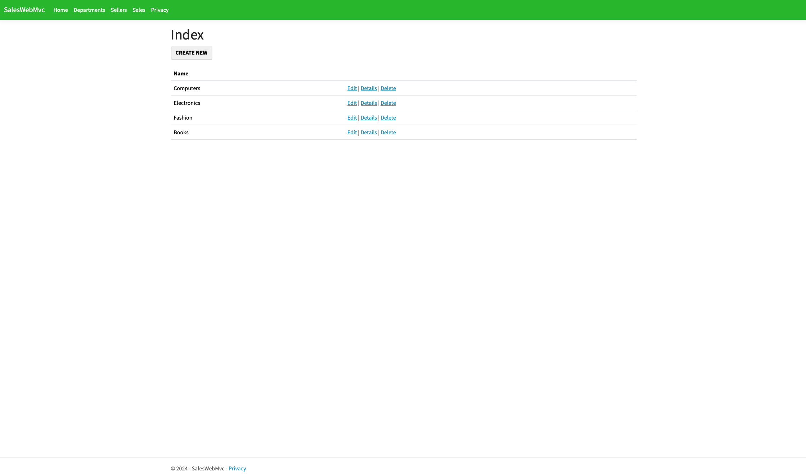

# Sales Web Mvc

### Overview

    - Implementation of salesperson system, where the salesperson belongs to a department, and has sales records associated with the salesperson. Sales records can be searched by a simple search and a group search.

### Project structure

    • Checklist:
      • wwwroot: application resources (css, imagens, etc.);
      • Controllers: application's MVC controllers;
      • Models: entities and "view models";
      • Views: pages (notice naming conventions against controllers):
        • Shared: views used for more than one controller;
      • appsettings.json: external resources configuration (logging, connection strings, etc.);
      • Program.cs: entry point;
      • Startup.cs: app configuration;

  

### Seeding Service

    • Checklist:
      • Stop IIS;
      • In Data, create SeedingService;
      • In Startup.cs, register SeedingService for dependency injection system;
      • In Startup.cs, add SeedingService as parameter of Configure method. Call Seed for development profile;

### Features

    • ASP.NET Core MVC;
    • Razor;
    • C#;
    • Entity Framework Core;
    • Migrations;
    • MySQL;
    • Bootstrap (bootstrap-lumen);

  

  

  

  

  

